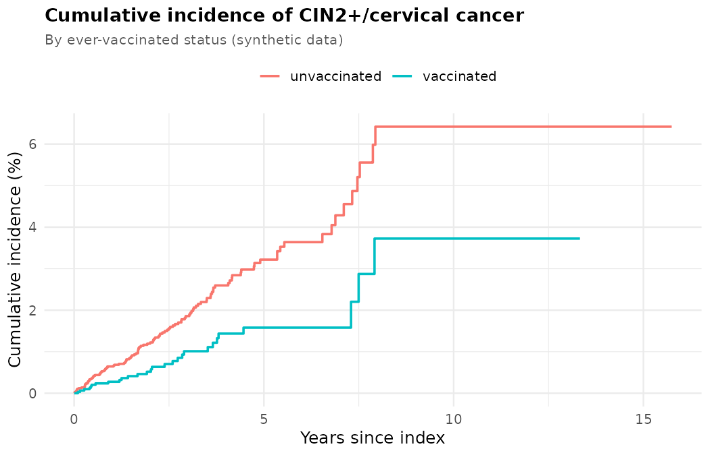
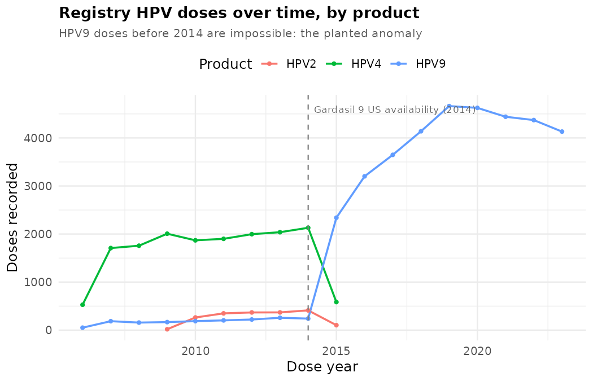

# rwe-vaccine-effectiveness-synthetic

I'm a **healthcare data scientist** working in real-world evidence (RWE) and
pharmacoepidemiology. My production work — on the **Pfizer COVID-19 RWE team**
and at **Target RWE** — is proprietary and can't be shared. **This repository
recreates those exact competencies, end to end, on fully synthetic claims data**
so every step is inspectable, runnable, and reproducible.

[](.github/workflows/ci.yml)
[](LICENSE)
[](https://orcid.org/0009-0000-7700-4614)

> 📚 **Publications & ORCID:** <https://orcid.org/0009-0000-7700-4614>

> ⚠️ **All data here is synthetic.** It is generated by code in this repo and
> describes no real person and no real vaccine's effectiveness. The "true" effect
> is a parameter baked into the generator so the analysis can be validated
> against ground truth. **Nothing here is a real effectiveness estimate.**

---

## What this demonstrates

A complete RWE vaccine-effectiveness study (HPV → cervical-cancer prevention),
mapped to the skills it exercises:

| Competency | Where in the repo | What it shows |
|---|---|---|
| **SQL cohort design** | [`sql/`](sql/) | Claims schema DDL, gaps-and-islands continuous enrollment, eligibility/washout, exposure indexing, a cross-source feasibility report |
| **Exposure-indexed time-to-event** | [`R/02`](R/02_exposure_indexing.R)–[`R/04`](R/04_survival_analysis.R) | Time-varying exposure (no immortal-time bias), Kaplan–Meier, incidence rates, Cox → `VE = (1 − HR) × 100%` |
| **Cross-source data-quality QC** | [`R/05_qc_checks.R`](R/05_qc_checks.R) | Reconciles registry vs. claims, detects & quantifies a planted classification anomaly |
| **Reproducible Dockerized pipelines** | [`Dockerfile`](Dockerfile), [`Makefile`](Makefile), [`tests/`](tests/), [`.github/`](.github/workflows/ci.yml) | One-command `make all`, seeded determinism, testthat suite, CI |

**Results teaser (synthetic):** from a 50k-member universe → a **9,850**-woman
cohort; the pipeline recovers the planted **VE ≈ 56% (95% CI 29–72%)**, and the
QC step independently flags **1,669 anomalous registry records across 1,288
patients**, confined to a single feed.

---

## Quickstart

```bash
# Whole pipeline in a container (DuckDB is embedded — no DB server needed)
docker compose run --rm analysis make all
```

`make all` runs: generate synthetic claims → build cohort (+ attrition table) →
index exposure → ascertain outcomes → survival analysis → QC checks → render
dashboard → run tests. Run it locally instead with `make all` if you have R +
DuckDB + Quarto. Try a fast pass with `make data N_MEMBERS=3000`.

---

## Repository structure

```
├── R/            00 generate · 01 cohort · 02 exposure · 03 outcome · 04 survival · 05 QC
├── sql/          schema · cohort_definition · exposure_index · feasibility_counts
├── docs/         protocol (SAP) · data_dictionary · results_summary
├── dashboard/    Quarto one-page summary (index.qmd)
├── tests/        testthat: reproducibility · attrition · anomaly catch
├── Dockerfile · docker-compose.yml · Makefile · .github/workflows/ci.yml
└── data/synthetic/   generated (gitignored) + a small committed sample
```

See [`PLAN.md`](PLAN.md) for the component-by-component design and
[`docs/results_summary.md`](docs/results_summary.md) for the plain-English findings.

---

## Dashboard & the QC catch

The pipeline renders a one-page [Quarto dashboard](dashboard/index.qmd)
summarizing cohort attrition, the survival curve, the effect estimate, and the
data-quality finding.

**Survival (descriptive cumulative incidence):**



**The QC catch** — cross-source reconciliation flags Gardasil 9 (HPV9) doses
recorded *before that product existed*, contradicted by the members' claims:



This is the reproducible version of a real data-quality story: an analyst plots
administrations over time, sees impossible product/date combinations in one
feed, reconciles against claims, quantifies the impact, and escalates to the
data vendor (see [`docs/results_summary.md`](docs/results_summary.md)).

---

## Disclaimer

All data is **fully synthetic** and generated by this repository. Results are a
**methods demonstration only** and are **not** real HPV (or any) vaccine
effectiveness estimates. Code, study design, and QC reflect production RWE
practice; the numbers do not describe reality.

## License

[MIT](LICENSE) © 2026 Angela Cook · ORCID [0009-0000-7700-4614](https://orcid.org/0009-0000-7700-4614)
